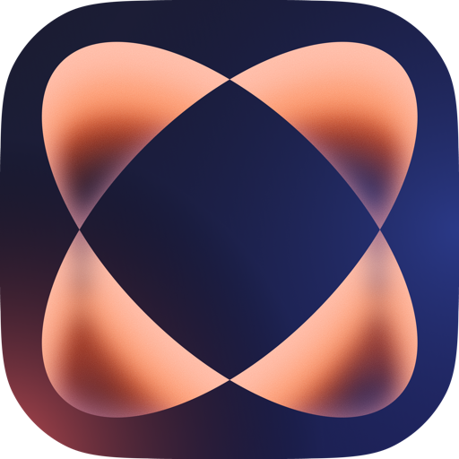

<p align="center">
  
</p>

<h1 align="center">DOKA</h1>

<p align="center">
  <b>D</b>ock <b>O</b>perations <b>K</b>it for <b>A</b>pple — menu-bar voice dictation
  and audio/video transcription for macOS.
</p>

<p align="center">
  <b>English</b> · <a href="README.ru.md">Русский</a>
</p>

<p align="center">
  
  
  
</p>

Press a global hotkey, speak, and the recognised text lands in whatever app you were
using. Recognition runs either **entirely on your Mac** — Whisper or Parakeet through
the Neural Engine, no internet and no API key — or through any OpenAI-compatible
service. DOKA lives in the menu bar and keeps no icon in the Dock.

The interface is localised in English and Russian; the code and its comments are
written in Russian.

## Features

- **Voice dictation** — global hotkey (or push-to-talk, or a mouse button) → recording →
  transcription → dictionary replacements → text pasted into the active app through the
  clipboard and a synthetic ⌘V.
- **Recording panel** — six styles: `aurora`, `studio`, `classic`, `mini`, `notch`
  (a strip that grows out of the camera cutout) and `hidden`.
- **Transcribe Audio** — drop in an audio or video file and get timestamped segments,
  subtitles (SRT/VTT) and optional speaker diarization. With the built-in service the job
  runs asynchronously: it survives network loss, sleep, and even an app restart — the
  result is collected without re-uploading the file or paying twice.
- **Recent transcriptions** — a local journal of finished and running jobs. Finished ones
  reopen with every export and a switchable timestamp detail level.
- **AI analysis** — meeting minutes, a summary, action items or your own prompt. The result
  renders as formatted text with headings, lists and tables; copying puts both plain and
  rich text on the clipboard, so tables paste as tables into Telegram, Notes or Word.
- **History** — a journal of dictations with metadata, playback, export (CSV or plain text)
  and a performance analysis screen.
- **Dashboard** — words dictated, time saved, and how much faster this is than your own
  typing (measured by a built-in typing test), plus a daily chart.
- **Sound processing** — microphone volume boost while recording, silence removal before
  upload, and system sounds on key transitions.
- **Dictionary** — case-insensitive replacement rules applied to every transcript.

## Privacy

The three recognition modes differ in what leaves your Mac:

| Mode | What leaves your Mac |
|---|---|
| Local models (Whisper, Parakeet) | **Nothing.** Audio never leaves the device, and no key is needed |
| Built-in service (Nexara) | Audio is uploaded to `api.nexara.ru` for recognition |
| Custom OpenAI-compatible service | Audio is uploaded to the endpoint you configure |

Everything else stays local. Transcript history, statistics and the transcription journal
live in `~/Library/Application Support/DOKA`. Storing dictation audio is **off by default**;
when enabled, recordings are kept locally as m4a and pruned on a schedule you choose. API
keys live in the macOS Keychain, never in config files.

## Requirements

- macOS 14 (Sonoma) or newer.
- Apple Silicon for the local models. Whisper runs on Intel too, but much slower; Parakeet
  requires Apple Silicon.
- Swift 5.9+ toolchain (Xcode 15 or newer) to build from source.
- An API key only if you pick a cloud service — local models need none.

## Installation

No signed release is published yet, so build from source:

```bash
git clone https://github.com/ippitenin/DOKA.git
cd DOKA/DOKA-app
./build.sh
```

The app is installed to `~/Applications/DOKA.app`. On first launch macOS asks for
**Microphone** and **Accessibility** permissions — the first records your voice, the second
pastes the text.

## Building and signing

All commands run from `DOKA-app/`:

```bash
swift build        # quick debug compile check
./build.sh         # release (universal: arm64 + x86_64), signed, installed to ~/Applications
./build.sh --dmg   # the same, plus DOKA.dmg in the repository root
./run.sh           # build.sh + launch
```

Release builds are signed with a self-signed **“DOKA Dev”** certificate — see
[`DOKA-app/scripts/make-dev-cert.md`](DOKA-app/scripts/make-dev-cert.md). Both the
certificate name and the install directory can be overridden with `DOKA_SIGN_ID` and
`DOKA_INSTALL_DIR`.

Installing from a DMG on another Mac means Gatekeeper does not know the certificate and
blocks the first launch: System Settings → Privacy & Security → **Open Anyway**, then grant
the microphone and accessibility permissions.

## Recognition services

Pick one in the **Service** section:

| Service | API key | Notes |
|---|---|---|
| Whisper Large v3 Turbo (Local) | not needed | ~1.6 GB one-time download, runs through WhisperKit on the Neural Engine |
| Parakeet TDT 0.6B v3 (Local) | not needed | ~1 GB, runs through FluidAudio, Apple Silicon only |
| Built-in (Nexara) | required | adds diarization, speaker roles, AI analysis and async jobs |
| Custom service | required | any OpenAI-compatible `/audio/transcriptions` endpoint |

Local models are downloaded once from the Service section, prepared for your chip on first
use, and unloaded from memory after five minutes of inactivity. Diarization, speaker roles
and AI analysis are extensions of the built-in service and stay hidden for the others — a
plain OpenAI-compatible API has no such fields, and its `prompt` means something else
entirely.

## Repository layout

| Path | Purpose |
|---|---|
| `DOKA-app/` | The application itself (SPM executable, AppKit + SwiftUI) |
| `DOKA_LOGO/` | Brand logo sources |
| `media/` | Images used by this README |
| `CLAUDE.md` | Detailed architecture and project invariants |

## Development

Architecture, invariants, commands and verification gates are documented in
[`CLAUDE.md`](CLAUDE.md). The short version: `DictationController` is the central state
machine; file transcription is deliberately isolated from the dictation pipeline
(`FileTranscriptionController` plus `Network/FileTranscriptionClient.swift`); the design
system lives in `UI/DesignSystem/`.

There are no automated tests. Instead: a build with no warnings, `plutil -lint` on both
`Localizable.strings` files, a signed release build, and a manual smoke pass over whatever
was touched. Pure logic is written to be testable and can be verified outside the app.

Two things worth knowing before you change dependencies or strings:

- **Do not move WhisperKit past the 0.18.x line** — in 1.x two executable products share a
  target and the universal build fails with “duplicate key found”.
- **Every interface string goes through `L("key")`**, and every key must exist in both
  `ru.lproj` and `en.lproj`. `swift build` does not validate `.strings` syntax — run
  `plutil -lint` after editing them.

Contributions are welcome — see [`CONTRIBUTING.md`](CONTRIBUTING.md).

## Credits and third-party licenses

Full list with versions and required notices: [`THIRD_PARTY_LICENSES.md`](THIRD_PARTY_LICENSES.md).

- [KeyboardShortcuts](https://github.com/sindresorhus/KeyboardShortcuts) — MIT
- [WhisperKit / argmax-oss-swift](https://github.com/argmaxinc/argmax-oss-swift) — MIT
- [FluidAudio](https://github.com/FluidInference/FluidAudio) — Apache-2.0
- [swift-transformers](https://github.com/huggingface/swift-transformers),
  [swift-jinja](https://github.com/huggingface/swift-jinja) and Apple’s `swift-*` packages — Apache-2.0
- [yyjson](https://github.com/ibireme/yyjson) — MIT

Speech models are downloaded by the user at runtime and are not part of this repository:

- [Whisper large-v3-turbo](https://huggingface.co/openai/whisper-large-v3-turbo) by OpenAI — MIT
- [Parakeet TDT 0.6B v3](https://huggingface.co/nvidia/parakeet-tdt-0.6b-v3) by NVIDIA — CC-BY-4.0

## License

[GPL-3.0](LICENSE) © Ilya Pitenin
